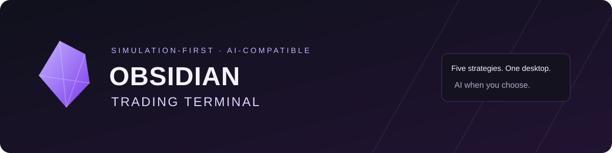

<div align="center">



# Obsidian Trading Terminal

### Your strategies. Your accounts. Your control.

A Windows desktop terminal for automated cryptocurrency spot and perpetuals trading.<br />
**Five strategies · Simulation-first · AI-compatible · Optional local Ollama integration**

[Get started](manual/Getting-Started.md) · [Deutsch](manual/Getting-Started-DE.md) · [Wiki](https://github.com/Chap0815/ObsidianTerminal/wiki) · [Strategy guide](manual/Strategies.md) · [Operating safely](manual/Operating-Safely.md) · [Updates](UPDATE_SETUP.md)

[Source releases](https://github.com/Chap0815/ObsidianTerminal/releases) · [Report a bug](https://github.com/Chap0815/ObsidianTerminal/issues) · [Ask the community](https://github.com/Chap0815/ObsidianTerminal/discussions)

</div>

> **Start in simulation.** Live mode can place real orders and cause financial losses.
> No profits, uninterrupted operation, execution quality or preservation of capital
> are promised. Local stop-loss and trailing logic require the software and its
> connections to work; they are not guaranteed exchange-side protection.
> [Read the operating guide](manual/Operating-Safely.md) before enabling LIVE.

## One terminal, five distinct approaches

Monitor strategy status, positions and PnL; manage parameters; inspect logs; and
start or stop individual bots from a native desktop interface. Each strategy runs
in a separate process with its own SIM/LIVE setting.

| Strategy | Market | Approach | Direction | Optional AI |
| :-- | :-- | :-- | :-- | :-- |
| **TREND** | Spot | Moving-average trend following across major assets | Long / flat | No |
| **SPOT** | Spot | Momentum candidates with entry and risk filters | Long / flat | Ollama news filter |
| **FUTURES** | USDT-linear perpetuals | Directional momentum with entry and risk filters | Long / short | Ollama news filter |
| **CROSS** | USDT-linear perpetuals | Relative-momentum long and short baskets | Long + short | No |
| **FUTREND** | USDT-linear perpetuals | Per-asset trend following | Long / flat | No |

CROSS targets a balanced book; this does **not** guarantee market neutrality or
protection from losses. Perpetuals introduce funding, margin and liquidation risks.
Strategy names describe their mechanics, not evidence of profitability.

All five shipped configurations use **simulation**. The optional AI filter is
disabled by default. Venue recording and L2 research capture are also disabled by
default; ordinary users do not need to collect research data to run the terminal.

[Explore how the strategies differ →](manual/Strategies.md)

## What you can do

<table>
<tr>
<td width="50%" valign="top">

### Operate from one desktop

- Start, stop and restart individual strategies.
- Inspect positions, realized/unrealized PnL and health information.
- Change supported parameters and optional AI prompts.
- Open logs and the local dashboard.

</td>
<td width="50%" valign="top">

### Evaluate before going live

- Begin with simulated execution.
- Explore backtests and parameter optimization.
- Inspect strategy and research output.
- Keep research collection an explicit opt-in.

</td>
</tr>
<tr>
<td width="50%" valign="top">

### Keep AI optional

- Use deterministic strategy logic without an LLM.
- Optionally connect SPOT/FUTURES to local Ollama.
- Use AI as a news-based entry filter, not a profit oracle.
- No hosted AI subscription is required for this integration.

</td>
<td width="50%" valign="top">

### Manage your own installation

- Store credentials and runtime state locally.
- Use a supported exchange adapter.
- Obtain public source updates over verified HTTPS.
- Preserve private configuration across supported updates.

</td>
</tr>
</table>

Backtests and simulated fills are models, not predictions. An optimizer can
overfit. A green health indicator describes technical readiness, not strategy
quality. See [Research & AI](manual/Research-and-AI.md).

## Get started on Windows

The reference environment is **Windows x64 with Python 3.12**. Python 3.12 is
recommended for the supplied dependency lock. Other platforms are not presented
as verified installation targets. A GPU is not needed for trading without AI;
optional local models have their own hardware requirements.

1. Download the [current source ZIP](https://github.com/Chap0815/ObsidianTerminal/archive/refs/heads/main.zip)
   and extract it into a dedicated folder. Do not run it inside the ZIP.
   Alternatively, clone the repository:

   ```powershell
   git clone https://github.com/Chap0815/ObsidianTerminal.git
   cd ObsidianTerminal
   ```

2. Run `install.bat` and read its prompts. The installer creates a local Python
   environment and installs dependencies. Ollama is optional; when available,
   the installer can download the configured model.

3. Run `start_launcher.bat`; on first launch it opens the setup wizard when
   `.env` is absent. Complete the wizard. Keep every strategy in **SIM**, review your exchange
   settings and use API permissions appropriate to your account.
   **Do not grant withdrawal permissions.**

4. In the launcher, start one strategy in simulation, inspect its logs
   and status, and learn the stop/restart behavior before considering LIVE.

The main branch changes over time. Review [release notes](RELEASE.md) and
[update instructions](UPDATE_SETUP.md), especially when migrating from an older
private/SSH-only installation. Source availability does not imply a signed
Windows installer is available.

[Complete installation walkthrough →](manual/Getting-Started.md)

## Exchange connectivity

The setup wizard offers **Bitget, Binance, OKX, Bybit, KuCoin, Gate.io and MEXC**.
Perpetual strategies expect USDT-linear products. Kraken and Coinbase are not
supported by this application.

An adapter being present does not mean every exchange, region, account mode or
order type has been certified in LIVE operation. Availability, API access,
permissions, position mode, market minimums and fees must be checked with your
exchange. Simulation may still make network requests and account probes.

[Configuration and account setup →](manual/Configuration.md)

## AI-compatible, not AI-dependent

The optional integration uses **Ollama** for local model inference in SPOT and
FUTURES. TREND, CROSS and FUTREND are mechanical strategies. Disabling the AI filter
does not disable the terminal.

“Local AI” does not mean “no network traffic”: the application contacts exchanges
and market-data services, optionally news/notification services, and update or
dependency sources. Do not publish credentials, raw logs or account data. The
dashboard defaults to localhost and is not intended as a public trading server.

[AI, network access and research boundaries →](manual/Research-and-AI.md)

## Understand the safety boundaries

- **Stop is not necessarily close.** “Stop without closing” can leave exchange
  positions open without further bot monitoring. Restart also preserves positions.
- **Local exits need a functioning runtime.** Outages, gaps, failed orders,
  unavailable liquidity and resource exhaustion can prevent timely action.
- **Shared-account coordination has limits.** The application tracks ownership to
  reduce conflicting bot entries; manual trades and unrelated software remain
  external activity that needs operator care.
- **Unknown is not zero.** A DB error or incomplete process scan must be investigated,
  not cleared by deleting state or disabling checks.
- **LIVE is your decision.** Review exposure, permissions and account state directly
  at the exchange. No configuration is offered as a guaranteed profitable setup.

[Safe operation and shutdown →](manual/Operating-Safely.md)

## Documentation & community

| Need | Start here |
| :-- | :-- |
| Install and first launch | [Getting started](manual/Getting-Started.md) · [Deutsch](manual/Getting-Started-DE.md) |
| Choose and understand a strategy | [Strategies](manual/Strategies.md) |
| Configure exchange, SIM/LIVE and local settings | [Configuration](manual/Configuration.md) |
| Stop, restart and handle open positions | [Operating safely](manual/Operating-Safely.md) |
| Update an existing installation | [Update guide](UPDATE_SETUP.md) |
| Investigate errors and degraded health | [Troubleshooting](manual/Troubleshooting.md) |
| Understand AI, backtests and research | [Research & AI](manual/Research-and-AI.md) |
| Understand the code structure | [Architecture](manual/Architecture.md) |
| Ask a usage question | [Discussions](https://github.com/Chap0815/ObsidianTerminal/discussions) |
| Report a reproducible bug | [Issues](https://github.com/Chap0815/ObsidianTerminal/issues) |
| Report a vulnerability | [Security policy](SECURITY.md) |
| Contribute or request help | [Contributing](CONTRIBUTING.md) · [Support](SUPPORT.md) |

## License & responsibility

**Source-available for noncommercial purposes**, under the
[project license](LICENSE), with an additional permission for natural persons to
simulate and trade solely for their own personal account using their own funds.
Seeking personal trading gains does not by itself disqualify that permitted use.

This is **not an OSI open-source license**. Commercial uses outside the license
require separate permission. Third-party dependencies retain their own licenses.
Read the [licensing guide](manual/Licensing.md) for the distinction between
personal use, commercial services and the underlying license.

This software is not investment advice. No outcome is promised. Warranty and
liability exclusions apply only to the extent permitted by applicable law;
mandatory legal rights are not waived.

---

<div align="center">

**Obsidian Trading Terminal**<br />
Five strategies. Simulation first. AI when you choose.

</div>
